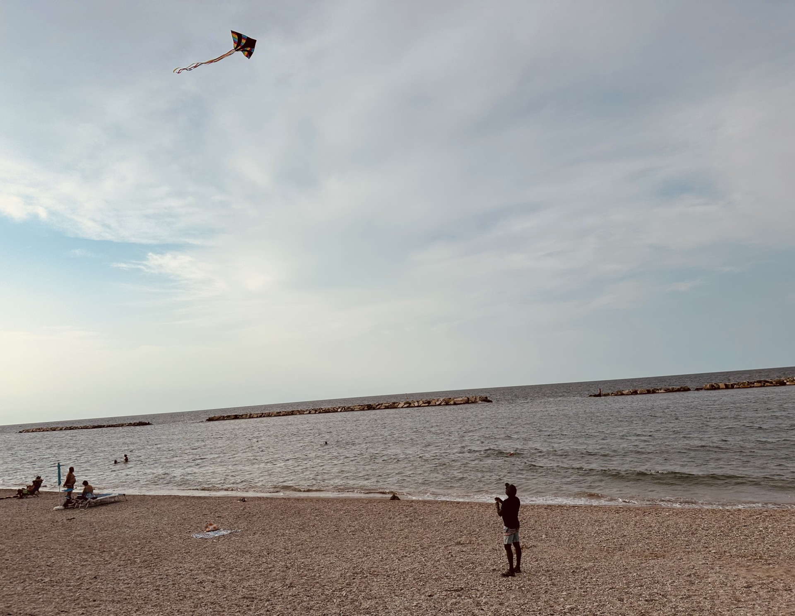
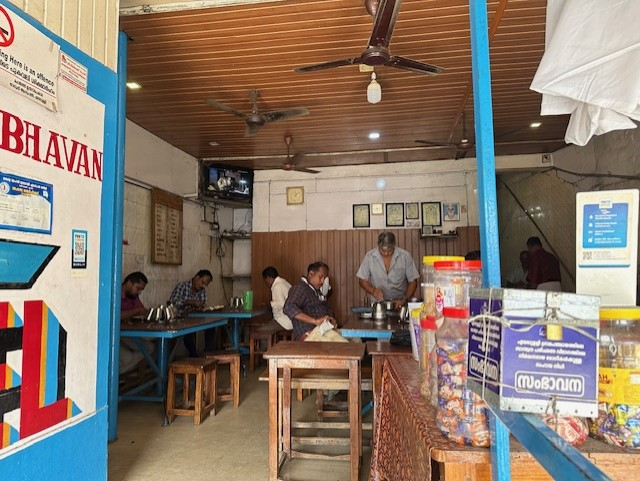
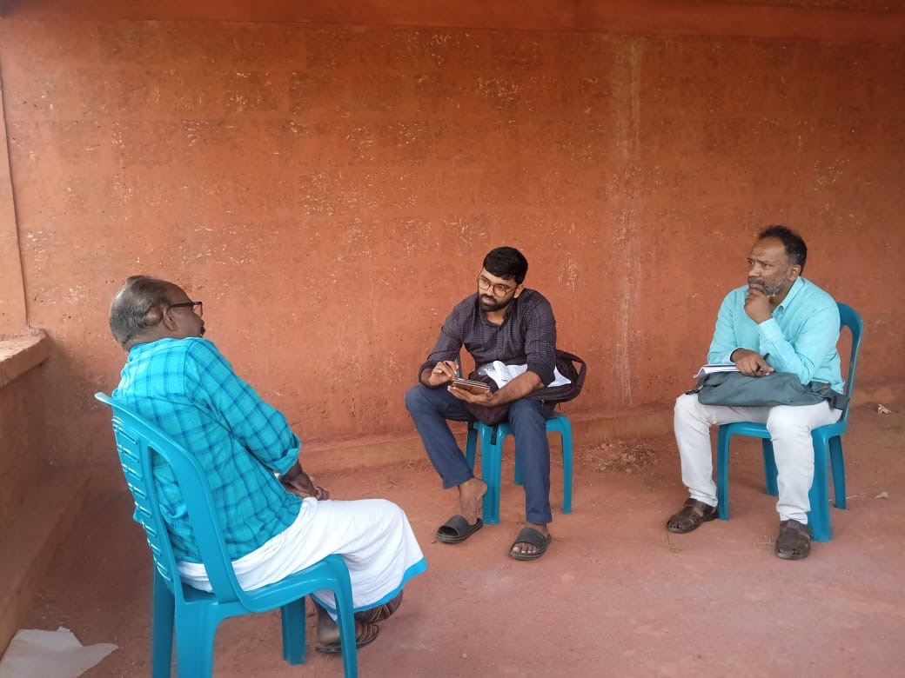
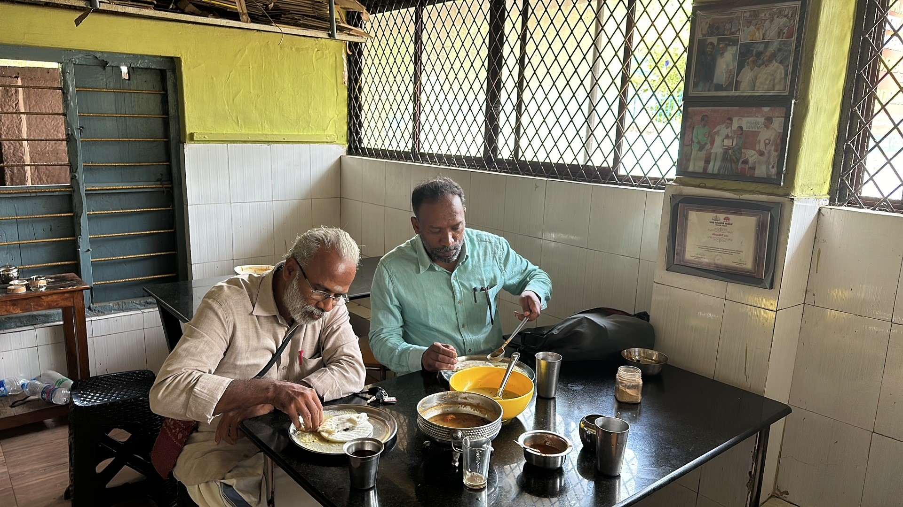
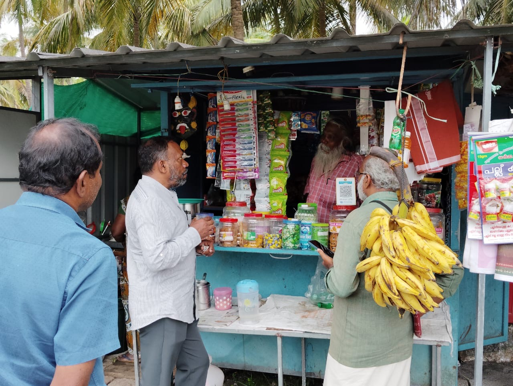
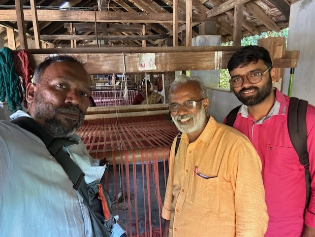
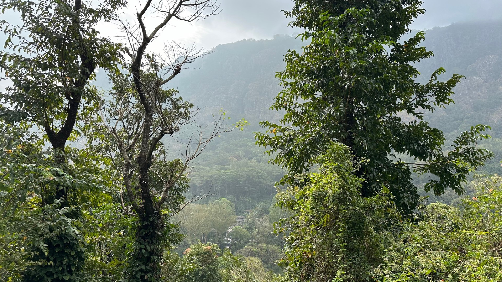
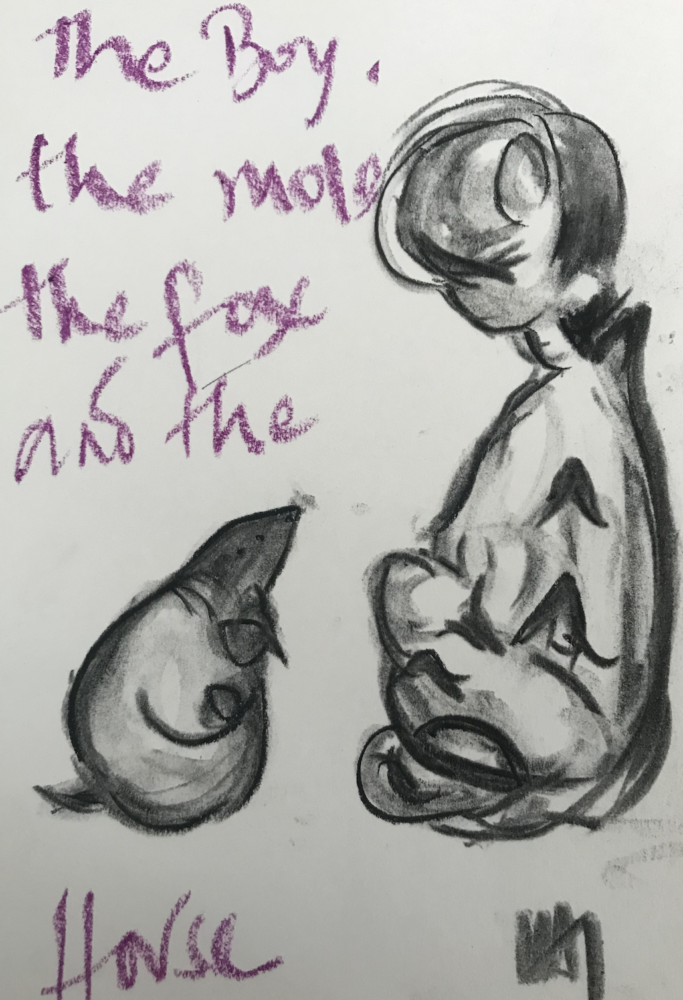
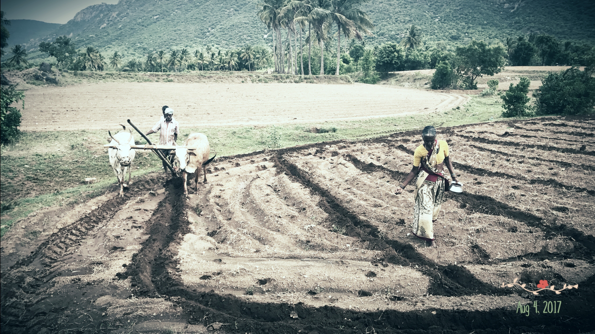

<!-- Global site tag (gtag.js) - Google Analytics -->

 
*Associate Professor of Economics*   
[Department of Public Policy](https://people.ceu.edu/anand_murugesan), [Central European University, Vienna](https://www.ceu.edu/vienna) 
B-412, Quellenstraße 51, 1100 Vienna  
Phone: +43.1.25230.2054

*Senior Researcher*  
[Vienna Center for Experimental Economics](https://vcee.univie.ac.at/home/), [University of Vienna](https://www.univie.ac.at/en/)  
Office 5.332, Oskar-Morgenstern-Platz 1, 1090 Vienna  

Twitter: [@tapasiva](https://twitter.com/tapasiva)

email: <murugesana@ceu.edu>

Affiliate Faculty: [Democracy Institute](https://democracyinstitute.ceu.edu/research/de-and-re-democratization-drd) and [Social Mind Center](https://socialmind.ceu.edu/)

Senior Fellow, [Institute of Advanced Studies Vienna (Insights Austria)](https://www.ihs.ac.at/ru/behavioral-economics/)

Here is a link to my [CV](https://www.dropbox.com/scl/fi/2mzcqfzp432sdk7qgl2fx/CV_AMurugesan_latest.pdf?rlkey=jbqvsiqfpeo6meja5vgqxxlt9&dl=0)

---
## News

[Starting June 2024, I'll work part-time at the University of Vienna to research "Emotional Politics of Democracies" with Jean-Robert Tyran, funded by a Horizon Europe grant](https://homepage.univie.ac.at/jean-robert.tyran/wwtf.html).

[*Demystifying causal inference*](https://link.springer.com/book/10.1007/978-981-99-3905-3) [(availabe on Amazon)](https://www.amazon.com/Demystifying-Causal-Inference-Public-applications/dp/9819939046/ref=monarch_sidesheet)

---

## Research 
 

**Fields of Interest**

Development  | Public Economics

Political Behavior | Experimental Economics 
 
### Current projects 

[From Enlightenment to Cameralism: Compliance and Tax Morale as Imperial Legacy](https://www.dropbox.com/scl/fi/9n0m0nvi432pwrvb32f86/Dorsch_Murugesan_Habsburgs_Jan2024.pdf?rlkey=cu3v34zs43clr6emdpnzzf4rc&dl=0), with [Michael Dorsch](https://sites.google.com/view/dorsch/home)

Valuing Democracy, with [Jean-Robert Tyran](https://homepage.univie.ac.at/jean-robert.tyran/index.html)
  - Voters' Dilemma, with [Thiagu Ranganathan](https://cds.edu/faculty/thiagu-ranganathan/) and Jean-Robert Tyran

Give or Take: Experimental examination of bribery vs. extortion, with [Robert Innes](https://robinnes.weebly.com/)

<!--  Emotions in Politics, with [Jorg Matthes](https://advertisingresearch.univie.ac.at/team/joerg-matthes/), Andreas Nanz & Jean-Robert Tyran -->

[Holy Cow! Conflicts, Markets, and Social Costs of Intolerance](https://www.dropbox.com/scl/fi/7gsm45u7gix0iy9f4ppc1/Holy_Cow_ECBS_BrownBag_April2024_v3.pdf?rlkey=ts3cko75rkoob75asyaylc3m8&dl=0), with [Jitendra Singh](https://sites.google.com/view/jitendrasingh07)
  - [Poster presented at the ASSA 2022 annual meeting](https://www.dropbox.com/s/n5nhjf3zn64f80t/Holy_Cow_AEA2022_Poster.pdf?dl=0)

[Let them play games! Experimental methods to elicit social norms](https://www.dropbox.com/s/frysh7muu82q56q/LetThemPlayGames_ESABologna2022_Abstract.pdf?dl=0), with Mahendran Chokkalingam, Christophe Heintz and Mia Karabegovic
 >  *The sticky self and the icky other!* Using coordination games to elicit self-image signals with C. Heintz and M. Karabegovic

<!--   Comparing the response variance between the many-to-one and one-to-one norm elicitation method -->

Yes, in my backyard! An empirical study of citizen efforts for environmental restoration, with [T. Centofanti](https://people.ceu.edu/tiziana_centofanti)

<!-- Impact of the US opioid crisis on Children, with Dana Andersen -->

### Book 

[*Demystifying causal inference*: Public Policy Applications with R](https://link.springer.com/book/10.1007/978-981-99-3905-3) (2023), with Vikram Dayal, Springer [Number of Accesses: >5000 since 1 October 2023]

### Publications 
["Leader and citizens participation for the environment: Experimental evidence from Eastern Europe,"](https://www.sciencedirect.com/science/article/abs/pii/S221480432200088X) with Tiziana Centofanti, *Journal of Behavioral and Experimental Economics,* October 2022 [Replication files on Mendeley Data](https://data.mendeley.com/datasets/2ssxp4cj23/1)

["*Drain on your health*: Sanitation externalities from dirty drains in India,"](https://onlinelibrary.wiley.com/doi/10.1111/rode.12924) with Vikram Dayal and Tauhidur Rahman, *Review of Development Economics,* November 2022 [Replication files on Mendeley Data](https://data.mendeley.com/datasets/2c3kzy4v93/3)

["Air Pollution Trade-Offs in Developing Countries: An Empirical Model of Health Effects in Goa, India,"](https://www.doi.org/10.1017/S1355770X21000152) with Sanghamitra Das, Vikram Dayal and Uma Rajarathnam, *Environment and Development Economics*, June 2021
[Replication files](https://www.dropbox.com/sh/nbfek922paco3vl/AACi31LUrwKxoVm4ugDoyTR5a?dl=0)

["Electoral clientelism and vote buying,"](https://oxfordre.com/politics/view/10.1093/acrefore/9780190228637.001.0001/acrefore-9780190228637-e-1334) *Oxford Research Encyclopedia of Politics*, 2020

["Use of Weather Information for Agricultural Decision Making,"](https://doi.org/10.1175/WCAS-D-12-00022.1) with George Frisvold, *Weather, Climate and Society*, 5, January Issue, 55-69, 2013.

### Working papers

["*Markets For Children*: International Adoptions, IVF, and U.S. Foster Care,"](https://www.dropbox.com/s/c7nslrtg0tg4b77/Markets_for_Children_MurugesanInnes_June2022.pdf?dl=0) with Robert Innes (under review)

[The puzzling practice of paying cash for votes](https://www.cesifo.org/DocDL/cesifo1_wp10504.pdf) with Jean-Robert Tyran (forthcoming, Elgar Encyclopedia of Public Choice)

<!-- ["Demystifying causal inference: ingredients of a recipe,"](https://www.dropbox.com/s/13fxlc6asavwdaf/demystifycausalinference_ieg_wp393.pdf?dl=0) with Vikram Dayal, *IEG working paper* -->

### Other

[Understanding our Political Nature: How to put knowledge and reason at the heart of political decision-making](https://knowledge4policy.ec.europa.eu/projects-activities/understanding-our-political-nature-how-put-knowledge-reason-heart-political_en), author of [the economics team report](https://www.dropbox.com/s/y3aowk1dxekfzsv/Economics_PoliticalBehavior_JRC_Nov2018.pdf?dl=00) with [Martina Barjaková](https://www.researchgate.net/profile/Martina-Barjakova-2) and [Michael Vlassopoulos](https://sites.google.com/view/michael-vlassopoulos/home), 2019 (the report was a foundation for the [European Democracy Action Plan](https://ec.europa.eu/commission/presscorner/detail/en/ip_20_2250))

#### Recent and upcoming presentations/research visits

<!-- [Wirtschafts Universität Wien](https://www.wu.ac.at/en/ims/news/seminar-series/) seminar series (October 11, 2022)

[Università Bocconi](http://www.igier.unibocconi.it/) (November 14 - 18, 2022)

[European Public Choice Society 2023](https://www.epcs2023.uni-hannover.de/en/) (March 22 - 25, 2023)

[Institute of Advanced Studies](https://www.ihs.ac.at/ru/behavioral-economics/) (May 3, 2023)

[Vienna Applied Micro Economics Workshop](https://viennappliedmicroeconomics.weebly.com/workshop.html) (June 19, 2023) 

[Western Economic Association 2023](https://weai.org/conferences/view/13/98th-Annual-Conference) (July 3 - 7, 2023)

[Stanford University](https://kingcenter.stanford.edu/) (July 10 - 12, 2023)

[Center for Development Studies, India](https://cds.edu/#m-10-2022) (August 4, 2023)

[Delhi School of Economics, India](http://econdse.org/cde-seminars/) (August 31, 2023)

[Indian Statistical Institute, Delhi](https://www.isid.ac.in/) (September 1, 2023)

[Democracy Institute Budapest](https://democracyinstitute.ceu.edu/news-events-events/rooftop-seminar-series) Rooftop seminar series (October 2, 2023) 

[Annual Conference on Economic Growth and Development](https://www.isid.ac.in/~acegd/acegd2023/index.html) (18 - 20 December, 2023) -->

[Workshop on "Uncovering the Historical Mechanisms of Persistence](https://dpp.ceu.edu/workshop-historical-persistence) (18 - 19 January, 2024)

[Econ CAKE talk, University of Utah](https://economics.utah.edu/events/index.php?trumbaEmbed=view%3Devent%26eventid%3D171610971) (February 23, 2024)

Workshop on Experiments in Research and for Policymaking, EUBA Bratislava (March 21, 2024)

[European Public Choice Society Meeting](https://www.wu.ac.at/epcs2024/) (April 2 - 5, 2024)

Azim Premji University, Bangalore (August 20, 2024)

[Slovak Economic Association Meeting (SEAM 2024)](https://slovakecon.sk/seam2024/program.html) (September 12 - 13, 2024)

Cornell University (Oct 3 - 5, 2024)

[Sciences Po](https://www.sciencespo.fr/axpo/people/visiting-fellows/), Paris (Research visit, 10 October - 3 November, 2024)

#### Links to recent collaborators

[Vikram Dayal](https://iegindia.org/team/vikram-dayal/) | [Michael Dorsch](https://sites.google.com/view/dorsch/home) | 
[Robert Innes](https://robinnes.weebly.com/) | [Jean-Robert Tyran](https://homepage.univie.ac.at/jean-robert.tyran/index.html)  

## Teaching

### Central European University, Vienna 

**Winter 2025** 

[Impact Evaluation: Policy Applications with R](https://ceu.studyguide.timeedit.net/modules/DOPP5078?type=CORE)

[Advanced Impact Evaluation](https://ceu.studyguide.timeedit.net/modules/DOPP5383?type=CORE)

[Economic Analysis for Public Policy](https://ceu.studyguide.timeedit.net/modules/DOPP5664?type=CORE)

## Bio

PhD, University of Maryland, College Park 
[Economics of Society: Essays on Health, Marriage and Child Adoption]
MA, Jawaharlal Nehru University, New Delhi 
BCom, Bangalore University (St. Joseph's College) 

Born 1980, Bangalore, Indian citizenship

## Various and sundry

Between December 2023 and February 2024, I was shuttling (actually, riding or pillion-riding a motorbike) across the Tamil Nadu and Kerala border (Palakkad-Pollachi), conducting fieldwork for the Valuing Democracy project. Some stills from the field: 

  

Debriefing and training enumerators at the field office in Vengodi, Palakkad. Our go-to lunch place was Hotel Venkatesh Bhavan -- uses a wood-fired stove for cooking and redolent of [Malgudi Days](https://www.youtube.com/watch?v=mIYA5qANs_A).

  

We interviewed scores of politicians: here is one with Libin and a stopover for the famed Ramasseri idli with Sreenivasan Ji. [Is it an idli or a dosa?](https://www.thehindu.com/life-and-style/food/ramasseri-idli-a-fusion-of-an-idli-and-a-dosa/article34206074.ece)

  

An impromptu discussion at a tea stall (with the stall owner, an insightful, white-bearded, old friend of Sreenivasan Ji's father) and the trusted Honda that got us around. 

  

An inspiring visit to the [Khadi](https://www.mkgandhi.org/swadeshi_khadi/whatiskhadi.htm) cottage industry next door (we bought handmade fabric for made-to-fit shirts by a local tailor) and taking in the moment with a view of the Silent Valley. 

<!-- Section to display the latest tweet -->

<!-- JavaScript to fetch and display the latest tweet -->
<!--

-->

<!-- You can find fieldwork pictures on our [Greening the Margin project here](https://tizianacentofanti.wixsite.com/personalwebsite/gallery) and --> 
Here is my sketch (below) of a bestselling book my daughter recommended I read, and I recommend you do; [it's a short read](https://www.charliemackesy.com/). 

 

And a dated picture of traditional seed sowing on my parents' farm in Tamil Nadu, India (below, on the left) and me breaking traditions (on the right).

  

My brother worked on [the effect of angular momentum or spin velocity in the formation of galaxies](https://academic.oup.com/mnras/article/483/2/2398/5222687); more recently on examining [the interactive effect of angular momentum and gravitation](https://arxiv.org/pdf/2006.08103.pdf) in the formation of celestial bodies. My brother lives in the part of the world where, in theory, water flowing down the drain is expected to spin in the opposite direction compared to the drains in parts I am in... ;)  

Shoutout to places I love eating at:  
- Dosa at [SN Refreshments](https://maps.app.goo.gl/ziETrgusZctJkbQFA)
- Filter coffee at a neighborhood A2B (Adyar Ananda Bhavan, a chain in south India). 
- Pizza at [Doma](https://maps.app.goo.gl/Gnx1d4ax8pvLoVx79)
- Gelato at [Carapina](https://maps.app.goo.gl/T8giLPcs9ZqubqCJ7) (two doors down from Doma -- an incredibly delightful corner)
- Phad krapow at [Kamala Thai Imbiss](https://maps.app.goo.gl/UCSbstNjs5gy8T7w9)
- Sacher torta at [Hotel Sacher](https://maps.app.goo.gl/Ca3dWBSgW5Q4E5Rf9)
  
---
*"The first principle is that you must not fool yourself -- and you are the easiest person to fool. So you have to be very careful about that. After you've not fooled yourself, it's easy not to fool other scientists. You just have to be honest in a conventional way after that." - Richard Feynman at Caltech, 1974*

 <!--  Excerpt from my 2015 Research Statement, which continues to hold today (I've mixed feelings about this consistency): `` ...The underlying theme of my research is throwing light on issues of society, where individual interest and a larger collective bargain are divergent ...and seeing how institutional arrangements, legal or economic, can improve individual incentives for better collective outcomes..."-->
  
Photo credit: Me flying a kite (Sabya); Fieldwork in Palakkad (Sreenivasan ji, Libin or me)

